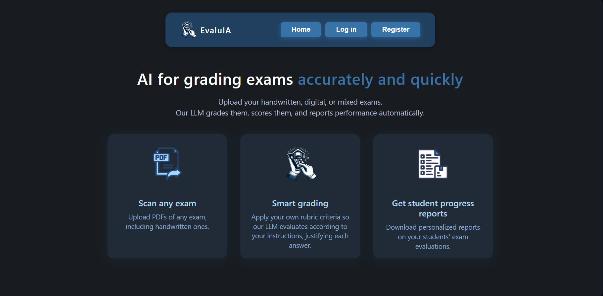
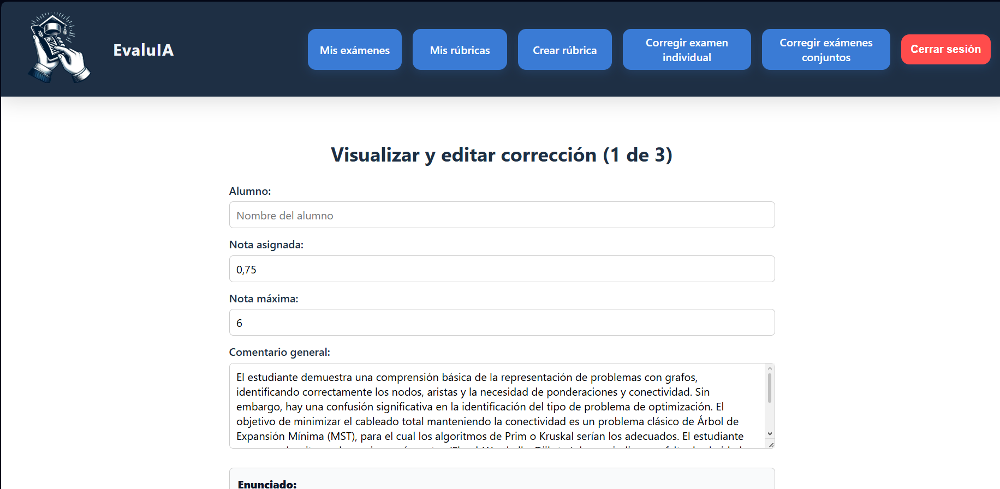

# EvaluAI (FastAPI + React + MongoDB + Docker)

Web application for automated exam grading assisted by an LLM, with optional feedback generation based on rubrics. It integrates a complete workflow from submission upload (PDF/files) and criteria definition, to evaluation, result reporting, and later export/query for review.

The objective of the project is to streamline grading and standardize evaluation criteria, while maintaining traceability of results and feedback (depending on the teacher’s configuration). It is designed as a final degree project (TFG) to demonstrate a full-stack architecture (FastAPI + React + MongoDB + Docker) and integration with a configurable LLM provider (e.g., Gemini). 

## Architecture

The project is divided into the following main components:

-Backend: REST API with FastAPI (handles business logic, evaluation, and persistence).
-Frontend: React (interface for uploading documents, managing rubrics, and reviewing results).
-Database: MongoDB (stores rubrics, exams, results, etc.).
-LLM provider: API integration (for example, Google Gemini).
-Infrastructure: Docker / Docker Compose for development and local deployment.

## Quick Overview




More screenshots: [docs/img/](docs/img/)

## Technologies

- Backend: Python + FastAPI (+ Uvicorn).
- Frontend: React 
- Database: MongoDB
- Infra/DevOps: Docker, Docker Compose.
- LLM: Google Gemini API 

## How to run

### With Docker (recommended)

1) Create your environment file:

```bash
cp .env.example .env
```

2) Start the stack:
  ```bash
    docker compose up --build
  ```
3) Open the app:

Frontend: http://localhost:3000

### Locally (without Docker)
Backend:
```bash
cd backend
python -m venv .venv
# Windows: .venv\Scripts\activate
source .venv/bin/activate
pip install -r requirements.txt
uvicorn app.main:app --reload --host 0.0.0.0 --port 8000
```

Frotend: 
```bash
cd frontend
npm install
npm run dev
```
 
Important (local mode): if you run the project **without Docker**, you need to have MongoDB available (local or remote) and set the `MONGO_URI` variable in your `.env` file.
