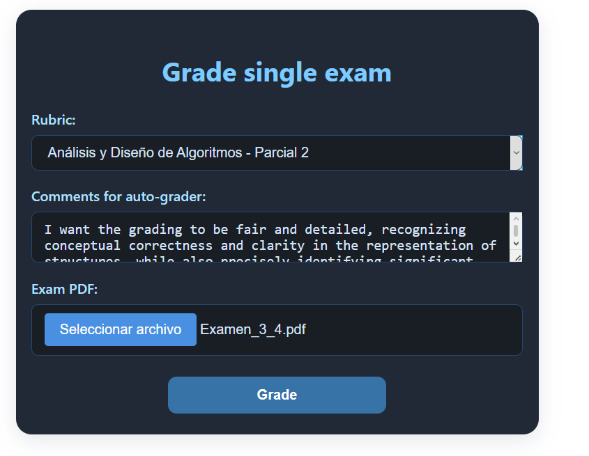
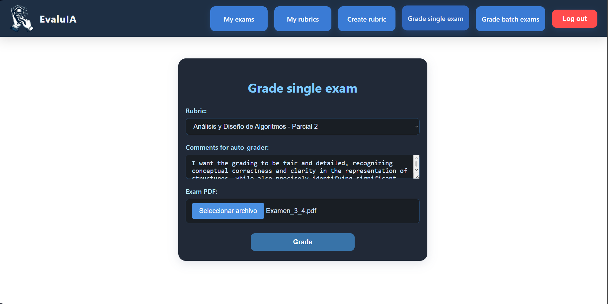
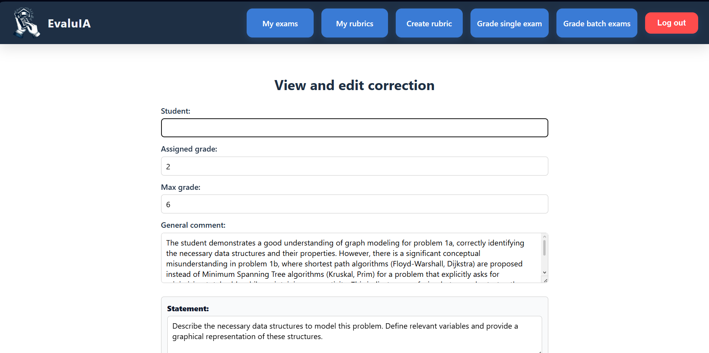
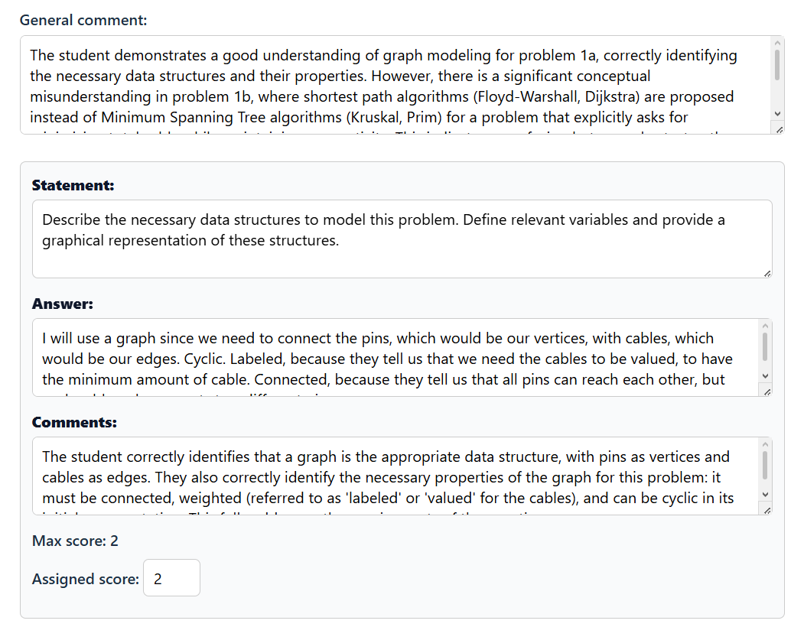
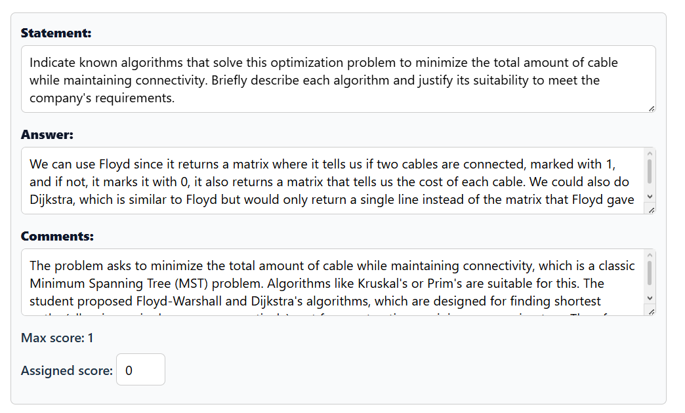
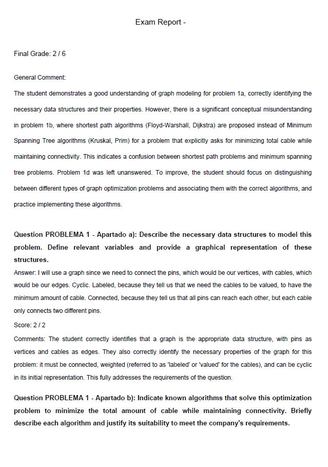

# EvaluAI (FastAPI + React + MongoDB + Docker)

Web application for automated exam grading and feedback generation based on LLMs and formal rubrics. It integrates a complete workflow from submission upload (PDF/files) and criteria definition, to evaluation, result reporting, and later export/query for review.

The objective of the project is to streamline grading and standardize evaluation criteria, while maintaining traceability of results and feedback (depending on the teacher’s configuration). It is designed to demonstrate a full-stack architecture (FastAPI + React + MongoDB + Docker) and integration with a configurable LLM provider (e.g., Gemini)

## Architecture

The project is divided into the following main components:

-Backend: REST API with FastAPI (handles business logic, evaluation, and persistence).
-Frontend: React (interface for uploading documents, managing rubrics, and reviewing results).
-Database: MongoDB (stores rubrics, exams, results, etc.).
-LLM provider: API integration (for example, Google Gemini).
-Infrastructure: Docker / Docker Compose for development and local deployment.

## Quick Overview


More screenshots: [docs/img/](docs/img/)

## Technologies

- Backend: Python + FastAPI (+ Uvicorn).
- Frontend: React 
- Database: MongoDB
- Infra/DevOps: Docker, Docker Compose.
- LLM: Google Gemini API 

## Application Walkthrough & Screenshots

Below is the step-by-step workflow of **EvaluAI** evaluating a real Computer Science exam (*Análisis y Diseño de Algoritmos*).

### 1. Grading Setup
Select your pre-configured rubric, write custom guidelines for the AI evaluator, and upload the student's exam PDF.

| Submit Exam Interface | Full Dashboard View |
| :---: | :---: |
|  |  |

---

### 2. Live Review & AI Correction Panel
Once processed, you can review the AI's grading item by item. The platform allows teachers to see specific comments, maximum scores, and even override the assigned grade manually.

<details>
<summary>📸 Click to expand the Review & Edit Interface screenshots</summary>

#### Main Correction Header & General Feedback


#### Itemized Evaluation (Criteria Breakdown)
* **Question 1a (Data Structures):** The student correctly modeled the problem using a connected, weighted graph (Score: 2/2).
* **Question 1b (Algorithm Selection):** The system successfully flagged a conceptual error when the student suggested Floyd-Warshall/Dijkstra instead of Minimum Spanning Trees (Score: 0/1).



</details>

---

### 3. Generated PDF Exam Report
Teachers can track all evaluations from the history table and download a clean, structured PDF report containing the comprehensive feedback loop for the student.

| Exam History List | Downloaded PDF Report Sample |
| :---: | :---: |
|  |  |

## How to run

### With Docker (recommended)

1) Create your environment file:

- **Linux / macOS:**
  ```bash
    cp .env.example .env
  ```

- **Windows (CMD):**
  ```cmd
    copy .env.example .env
  ```

⚠️ **IMPORTANT: Configure Gemini API Key**
Before running the application, you must configure your Gemini API Key inside the newly created `.env` file. Without this step, the application will fail to start, and the Docker containers will throw errors. Additionally, ensure that your Google AI Studio / Gemini account has a valid billing card linked to it, as the API Key may not function properly on completely free or unverified tiers.

2) Start the stack:
  ```bash
    docker compose up --build
  ```
3) Open the app:

Frontend: http://localhost:3000

### Locally (without Docker)
Backend:
```bash
cd backend
python -m venv .venv
# Windows: .venv\Scripts\activate
source .venv/bin/activate
pip install -r requirements.txt
uvicorn app.main:app --reload --host 0.0.0.0 --port 8000
```

Frotend: 
```bash
cd frontend
npm install
npm run dev
```
 
Important (local mode): if you run the project **without Docker**, you need to have MongoDB available (local or remote) and set the `MONGO_URI` variable in your `.env` file.
